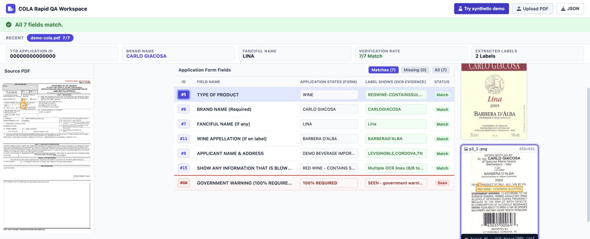
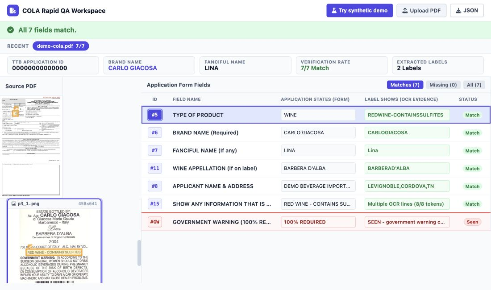
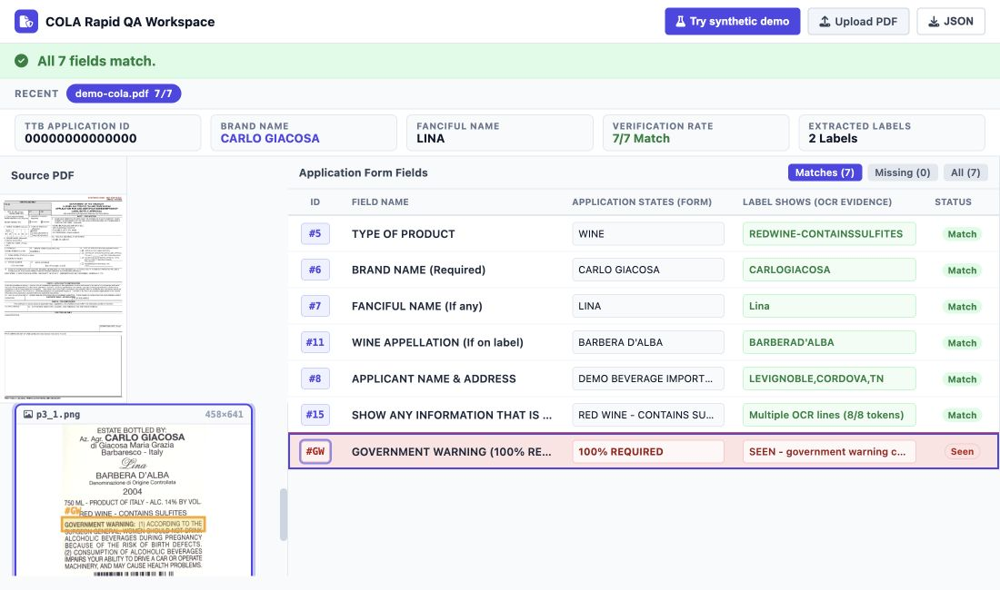
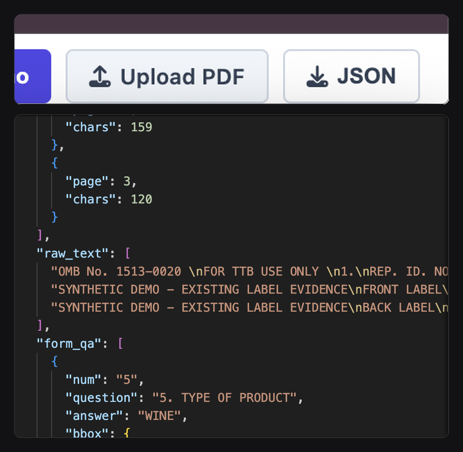

# COLA Rapid QA

Compare a TTB COLA application with the text printed on its label images.

**[Open the live website](https://violin-incidence-facilitate-remember.trycloudflare.com/)**

## Approach

This project intentionally avoids using a large cloud vision model as the main
way to read labels.

For a basic OCR task, sending every document to a large vision model can add
cost, delay, and the risk of a confident but incorrect answer. Those models
can be useful for harder visual problems or unusual cases, especially when a
reliable foundational model can run locally. They are not the right default for
repeatedly checking simple text on a label.

Instead, this demo uses a focused document-to-label workflow:

1. Read the COLA application PDF.
2. Extract the label images included with it.
3. Read the label text with OCR.
4. Compare that text with the important information on the application.
5. Show the worker the evidence for each result.

This is not automation. It does not approve or reject a label, replace a
reviewer, or make a compliance decision. It is a tool meant to save workers
from repeatedly searching for the same obvious information by hand, while
leaving the final judgment with the person doing the review.

## What would turn this from a demo into an office tool

The next improvements should focus on the worker's actual environment, not on
adding unnecessary AI:

- Better image preparation, including super-resolution training, for blurry,
  low-quality, or difficult label images.
- A stronger workspace with clearer drag-and-drop handling and a smoother
  review flow.
- Integration into the office's existing .NET architecture, so the tool fits
  into the systems workers already use.

The goal is simple: make routine review faster and easier without taking
judgment away from the reviewer.

## Try the demo

Click **Try synthetic demo** to run the complete workflow with fictional
application data. The `7/7` result is calculated live by OCR and matching; it
is not hardcoded.



## Read a result

Each row compares one application field with label OCR evidence. Click an ID to
highlight the corresponding text on the application and label.



Every analysis ends with `#GW`. This required row reports whether the government
warning is **Seen**, **Incomplete**, or **Not seen**.



## Improve from difficult cases

If a match has a low confidence score, looks wrong, or needs a closer look,
click **JSON** to download that analysis record.



The export preserves the application fields, OCR evidence, match results, and
confidence values from that specific case. Save it for review, then have a
person mark what was correct or incorrect. A downloaded OCR result is not
training truth by itself: only reviewed and corrected exports should be added
to an evaluation or training set.

This gives the office a feedback loop based on its own work. A narrow issue can
be addressed in days, recurring patterns can be collected over weeks, and an
approved history of difficult cases can support improvements over months. The
office controls the priorities and timing instead of waiting for a generic
outside model or vendor update.

## Layout

- `native/` — C++ analyzer and its bundled headers
- `web/` — FastAPI application, OCR matcher, UI template, and Python manifests
- `scripts/` — local launch tooling
- `deploy/` — Docker Compose, Dockerfile, and systemd assets
- `docs/` — operational documentation and screenshots

## Run it on your Mac

You need Python 3.11, CMake, MuPDF, and Tesseract installed first.

Run these commands one at a time in Terminal:

```bash
# Make a private Python setup for this project
python3.11 -m venv .venv

# Install what the website needs
.venv/bin/python -m pip install -r web/requirements.lock

# Build the label-reading program
MUPDF_ROOT="$(brew --prefix mupdf)" cmake -S native -B build -DCMAKE_BUILD_TYPE=Release
cmake --build build --parallel
install -d bin
install -m 0755 build/cola_label_qa bin/cola_label_qa

# Start the website
PORT=8080 ./scripts/start_web.sh
```

Then open `http://127.0.0.1:8080`.

## Check that it works

```bash
# Run the safety checks
.venv/bin/python -m unittest discover -s tests -v

# Try the included example
./bin/cola_label_qa samples/demo-cola.pdf --task both --json --out build/sample-images
```

The tests should finish with `OK`. The example creates extracted label images
in `build/sample-images`.

## Notes

- The demo uses a real [TTB F 5100.31](https://www.ttb.gov/system/files/images/pdfs/forms/f510031.pdf) form with made-up example information.
- PDFs you upload and generated results are not publicly available.
- Windows has not been tested yet.
- Server setup and recovery instructions are in [the deployment guide](docs/deployment.md).
